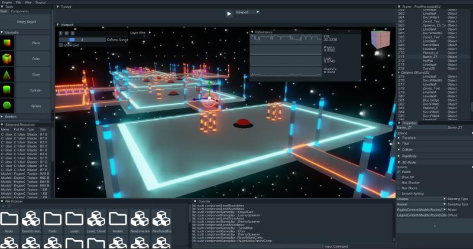
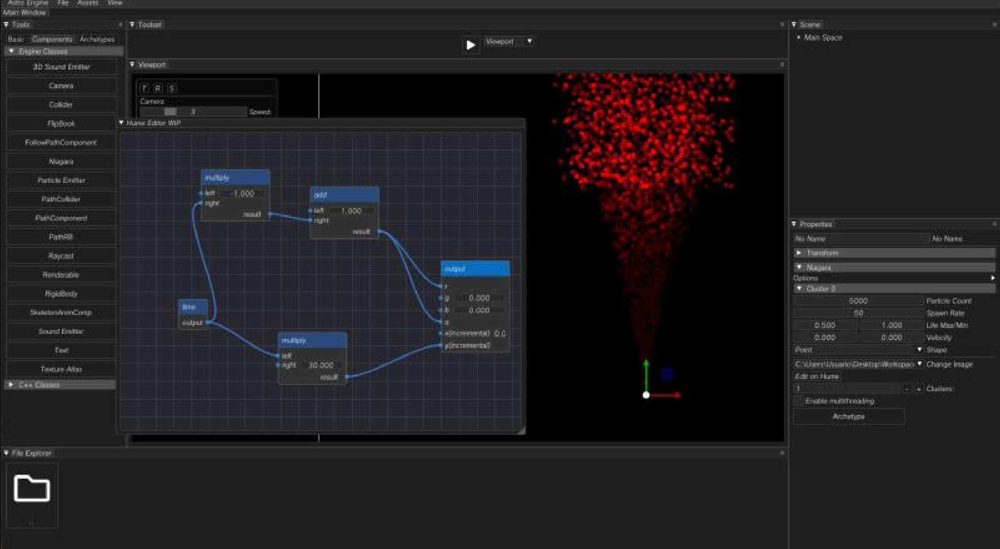

# Krew Engine

### Project Preview
#### Actor Steering

#### Terrain Generation

  

## Features 📋
⚡️ Keyboard, Mouse & Gamepad Input
⚡️ Debug Information
⚡️ Texturing
⚡️ Lighting & Shadows
⚡️ Normal Mapping
⚡️ Custom 3D Model Rendering
⚡️ Skybox
⚡️ Post Processing
⚡️ Bloom
⚡️ HDR
⚡️ Skeletal Animation
⚡️ Particle System 
⚡️ Text Rendering
⚡️ Collision Detection and Physics
⚡️ Space Partitioning
⚡️ Cameras, CameraPaths and Springarms
⚡️ WYSIWYG Editor GUI
⚡️ Hierarchies
⚡️ Archetypes and Prefabs
⚡️ UI System
⚡️ State Machines & Control Flow
⚡️ 3D Audio
⚡️ Background Audio
⚡️ Multithreading

## Work in Progress
⚡️ SSAO
⚡️ Deffered Shading
⚡️ Cutscene Editor
⚡️ Node Editor

## Installation & Deployment 📦
- Clone the repository
- Open and build using Visual Studio 2023

## Tools Used 🛠️
* <b>ImGui</b> - Dear ImGui is a bloat-free graphical user interface library for C++.
* <b>FMOD</b> - Audio Library.
* <b>Assimp</b> - A library to import and export various 3d-model-formats including scene-post-processing to generate missing render data.

## License

- **[MIT license](http://opensource.org/licenses/mit-license.php)**
